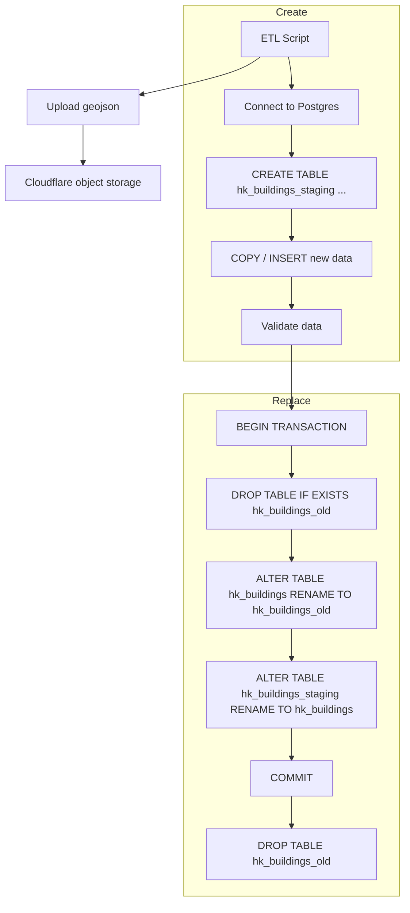

## Data-etl

- Simple script for cronjob fetching `data.gov.hk` API to check update date. 
- If data is more updated than our own compared with our metadata, new set of data is fetched.
- Dataset is obtained as `.zip` format so `zipfile` is used to load geojson object into memory and process.
- Output is pushed to PostgresDB for backend usage



### Data Source:

https://portal.csdi.gov.hk/geoportal/#metadataInfoPanel

### Direct Url

https://static.csdi.gov.hk/csdi-webpage/download/51d63757e2675874af80eef94afb6a35/geojson

### Data source metadata (to fetch last update)

https://data.gov.hk/en-data/api/3/action/package_show?id=hk-landsd-openmap-landsd-building

```json
{
    "resources": [
        {
            "created": "2025-03-11T16:37:32.299839",
            "dateCreated": "2022-07-01",
            "datePublished": "2022-12-01",
            "description": "A polygon showing the permanent buildings or structures, including the building footprint. Attributes include the building types, building names, building height etc.",
            "format": "API",
            "url": "https://portal.csdi.gov.hk/geoportal/?datasetId=landsd_rcd_1637211194312_35158",
            ...
        }
    ]
}
